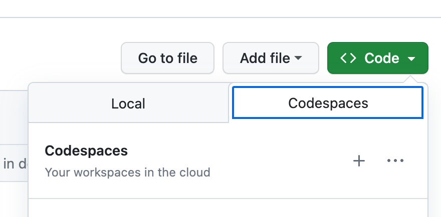
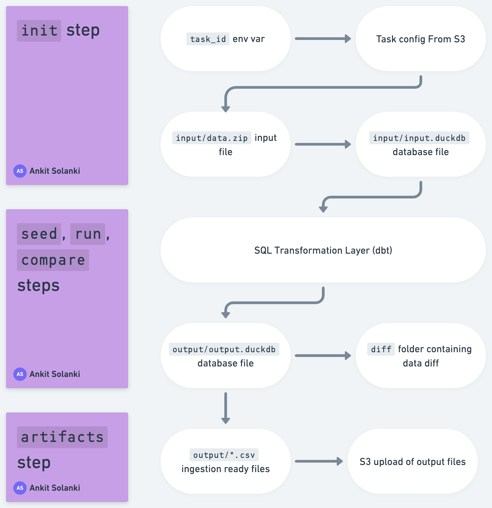

# Integration Transformation Layer using dbt

This repository contains several dbt projects (one per enterprise) which do transformations of raw data (in CSV / Excel files) into the **ingestion ready** formats for CFC products.

This is a V0, so it takes a few shortcuts:

- All transformations are stateless
  - All required masters should be present in filesytem
  - Every time the dbt projects is run, we generate the output for all transactions present
- Code is copy-pasted for each new enterprise
  - Over time we will build a library of 'base' transforms.

## Currently Implemented companies

These are production transforms:

- **clear**: this is a transformation layer for our test ECC instance.
- enpro
- sapphire

These are deprecated, they were only used for testing / developing the transform layer:

- jspl
- usha
- stovekraft
- hello-world
- irb

## Set up a development environment

The easiest way to run this project is via **Github CodeSpaces**.

Click on the _Code_ icon in github and launch a new codespace / start an existing codespace:



### Alternate: Local development

Recommended only if you are familiar with python development on the command line!

- Setup a virtual environment and install dependencies
- Install duckdb cli v0.8.1

## Development

### Get data

**Note**: data for our customers isn't committed to this repository. You need to put in the right data file in the `input` folder.

Reach out to the team for access.

### Running transformations

Run `make` on the command line. Example:

```
# Go to a transform folder
$ cd enpro

# Run make
$ make
```

The `make` command without any arguments will do the following:

- initialize the project by creating the local duckdb files (`make init`)
- setup dbt seeds (`make seed`)
- run dbt transform layer (`make run`)
- run test cases (`make test`)
- run a data diff tool (`make compare`)
- generate output files (`make artifacts`)

You can run individual steps directly as well.

### Generating DBT Documentation

Run the following commands within a transformation project:

```
# Generate dbt docs
$ make docs
# Run dbt docs server
$ make serve
```

### Connecting to the db

Run the following command to connect to the local duckdb database:

```
$ make connect
```

## Project Conventions

Each transform layer takes input on the file system and generates output files on the file system.

The typical process is:



Default conventions within each project:

- `input/input.duckdb` is where the local database is expected
  - If this is missing, we try to generate it from the `input/data.zip` file (containing zipped json files from our SAP connector)
  - If `data.zip` is also missing, we try to download it from S3 using the current task id
- `output/output.duckdb` is where the output duckdb database is created
- `output/*.csv` will contain ingestion-ready CSV files
- `diff` folder will contain comparisons against any reference files we have (eg: customer's SR or PR)
- The duckdb database may also have a GL Recon output, useful for local development.

## Pending

- **TODO** Document GL recon
- **TODO** Test cases
- **TODO** Normalising the transform layer to have common code
- **TODO** Document common SR and PR transformation logic
